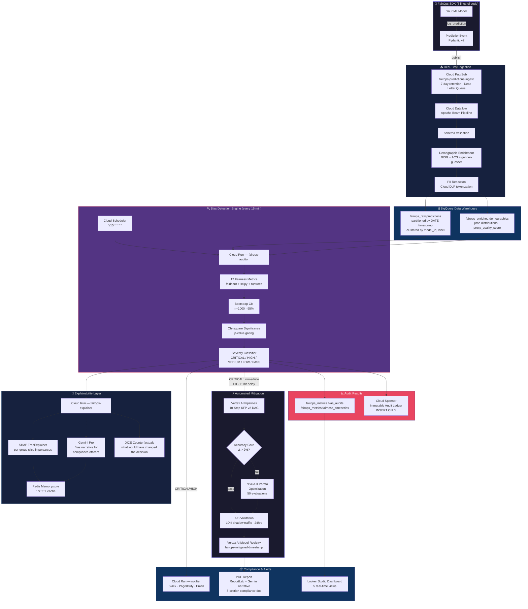

<div align="center">

<br/>

```
███████╗ █████╗ ██╗██████╗  ██████╗ ██████╗ ███████╗
██╔════╝██╔══██╗██║██╔══██╗██╔═══██╗██╔══██╗██╔════╝
█████╗  ███████║██║██████╔╝██║   ██║██████╔╝███████╗
██╔══╝  ██╔══██║██║██╔══██╗██║   ██║██╔═══╝ ╚════██║
██║     ██║  ██║██║██║  ██║╚██████╔╝██║     ███████║
╚═╝     ╚═╝  ╚═╝╚═╝╚═╝  ╚═╝ ╚═════╝ ╚═╝     ╚══════╝
```

### **Real-Time ML Bias Monitoring & Automated Mitigation Pipeline**

*Google Solution Challenge 2026 · Track: Unbiased AI Decision · Team: Toro Bees*

<br/>

[](https://www.python.org/)
[](https://cloud.google.com/)
[](https://cloud.google.com/vertex-ai)
[](https://deepmind.google/technologies/gemini/)
[](https://www.terraform.io/)
[](./LICENSE)
[](https://pytest.org/)
[](https://fastapi.tiangolo.com/)

<br/>

> **FairOps** is a production-grade, GCP-native MLOps platform that continuously monitors deployed ML models for algorithmic bias, generates Gemini-powered plain-English explanations for compliance officers, and automatically triggers a 10-step Vertex AI mitigation pipeline — all with a 3-line SDK integration.

<br/>

[🚀 Quickstart](#-quickstart) · [🗺 Architecture](#-architecture) · [📐 Fairness Metrics](#-the-12-fairness-metrics) · [🔌 API Reference](#-api-reference) · [⚙️ Infrastructure](#%EF%B8%8F-infrastructure--terraform) · [🛡 Security](#-security) · [🤝 Contributing](#-contributing)

</div>

---

## 📋 Table of Contents

- [Why FairOps?](#-why-fairops)
- [Key Features](#-key-features)
- [Architecture](#-architecture)
- [Data Flow, End-to-End](#-data-flow-end-to-end)
- [Repository Structure](#-repository-structure)
- [Quickstart](#-quickstart)
- [SDK Integration](#-sdk-integration)
- [The 12 Fairness Metrics](#-the-12-fairness-metrics)
- [Severity Classification](#-severity-classification)
- [Mitigation Pipeline](#-the-10-step-vertex-ai-mitigation-pipeline)
- [Explainability (SHAP + Gemini)](#-explainability-shap--gemini-pro)
- [API Reference](#-api-reference)
- [Data Schemas](#-data-schemas)
- [BigQuery Data Warehouse](#-bigquery-data-warehouse)
- [Cloud Spanner Audit Ledger](#-cloud-spanner-immutable-audit-ledger)
- [Demographic Enrichment](#-demographic-enrichment--pii-redaction)
- [Infrastructure & Terraform](#%EF%B8%8F-infrastructure--terraform)
- [Observability](#-observability)
- [CI/CD Pipeline](#-cicd--cloud-build)
- [Security](#-security)
- [Environment Setup](#-environment-setup)
- [Running Tests](#-running-tests)
- [Compliance & Regulatory Framework](#-compliance--regulatory-framework)
- [Roadmap](#-roadmap)
- [Contributing](#-contributing)
- [License](#-license)

---

## 🔥 Why FairOps?

Modern ML models make life-altering decisions — who gets hired, who gets a loan, who gets bail. The fairness of these decisions often degrades silently in production as data distributions shift. **Bias is not a training-time problem; it's a production problem.**

| The Problem | What typically happens | What FairOps does |
|---|---|---|
| Bias is invisible | Models ship biased; no one knows until public harm | Continuous 15-minute audit cycles with 12 metrics |
| Root causes are opaque | "The model said no" — nobody can explain why | SHAP feature attribution + Gemini Pro plain-English narrative |
| Fixing bias is manual | Engineers take weeks; compliance waits months | Automated 10-step Vertex AI mitigation pipeline, triggered in seconds |
| Compliance is a nightmare | Lawyers piece together logs from 5 different systems | Immutable Cloud Spanner audit ledger + exportable PDF compliance reports |
| Integration is expensive | Fairness tooling requires months of work | 3-line SDK integration — `pip install`, 3 lines, done |

---

## ✨ Key Features

```
┌─────────────────────────────────────────────────────────────────────────┐
│                         FAIROPS CAPABILITIES                            │
├─────────────────────────────────┬───────────────────────────────────────┤
│  🔍  DETECT                     │  🧠  EXPLAIN                          │
│  • 12 production fairness       │  • SHAP TreeExplainer &               │
│    metrics computed every 15min │    KernelExplainer per group          │
│  • Bootstrap confidence         │  • Gemini Pro bias narratives         │
│    intervals (n=1000, 95% CI)   │    for compliance officers            │
│  • Chi-square statistical       │  • DiCE counterfactual examples       │
│    significance gating          │  • SHAP beeswarm plots → GCS          │
│  • CUSUM + ADWIN drift          │  • Redis cache (1hr TTL)              │
│    detection                    │                                       │
├─────────────────────────────────┼───────────────────────────────────────┤
│  ⚡  MITIGATE                    │  📋  COMPLY                           │
│  • 10-step KFP v2 Vertex AI     │  • Immutable Cloud Spanner ledger     │
│    pipeline, auto-triggered     │  • EU AI Act, EEOC 4/5ths,           │
│  • Pre-, In-, Post-processing   │    GDPR Art.22, DPDPA coverage       │
│    + Full Retraining stages     │  • PDF compliance reports via         │
│  • AIF360 algorithm library     │    Gemini + ReportLab                 │
│  • NSGA-II Pareto optimization  │  • Looker Studio real-time           │
│  • Accuracy-constrained (<2%Δ)  │    dashboard (5 views)                │
│  • A/B shadow validation        │  • Slack / PagerDuty / Email alerts  │
│  • Vertex AI Model Registry     │                                       │
│    auto-promotion                │                                       │
└─────────────────────────────────┴───────────────────────────────────────┘
```

---

## 🗺 Architecture

FairOps is built entirely on GCP-native services with zero managed dependencies outside the Google Cloud ecosystem.

```
╔══════════════════════════════════════════════════════════════════════════════════╗
║                          FAIROPS SYSTEM ARCHITECTURE                           ║
╠══════════════════════════════════════════════════════════════════════════════════╣
║                                                                                ║
║   ┌─────────────────────────────────────────────────────────────┐             ║
║   │           YOUR DEPLOYED ML MODEL (any framework)            │             ║
║   │    sklearn • PyTorch • XGBoost • TensorFlow • any model     │             ║
║   └────────────────────────────┬────────────────────────────────┘             ║
║                                │                                              ║
║                    ┌───────────▼───────────┐                                  ║
║                    │    FairOps SDK        │  ← 3 lines of code               ║
║                    │  pip install fairops  │    (publisher.py)                 ║
║                    └───────────┬───────────┘                                  ║
║                                │ PredictionEvent (Pydantic v2)                ║
║                                ▼                                              ║
║              ┌─────────────────────────────────┐                              ║
║              │   Cloud Pub/Sub                  │  topic: fairops-predictions  ║
║              │   fairops-predictions-ingest     │  DLQ: fairops-predictions-dlq║
║              │   7-day retention · 5 retries    │  backoff: 10s → 600s        ║
║              └──────────────┬──────────────────┘                              ║
║                             │                                                 ║
║                             ▼                                                 ║
║     ┌────────────────────────────────────────────────────────┐               ║
║     │         Cloud Dataflow — Apache Beam Pipeline          │               ║
║     │                                                        │               ║
║     │  ┌──────────────┐  ┌──────────────┐  ┌─────────────┐ │               ║
║     │  │  Schema      │  │ Demographic  │  │    PII      │ │               ║
║     │  │  Validator   │→ │  Enricher    │→ │  Redactor   │ │               ║
║     │  │  (Pydantic)  │  │  (BISG/ACS) │  │ (Cloud DLP) │ │               ║
║     │  └──────────────┘  └──────────────┘  └──────┬──────┘ │               ║
║     │           ↓ malformed events                 │        │               ║
║     │     [Dead Letter Topic]                       │        │               ║
║     └───────────────────────────────────────────────┼────────┘               ║
║                                                     │                        ║
║                             ┌───────────────────────▼───────────────────┐    ║
║                             │              BigQuery                      │    ║
║                             │  fairops_raw.predictions     (partitioned) │    ║
║                             │  fairops_enriched.demographics (partitioned│    ║
║                             │  fairops_metrics.bias_audits  (CLUSTER BY  │    ║
║                             │  fairops_metrics.mitigation_log  model_id) │    ║
║                             │  fairops_metrics.fairness_timeseries       │    ║
║                             └──────────────┬────────────────────────────┘    ║
║                                            │                                 ║
║                   ┌────────────────────────▼────────────────────────────┐    ║
║        (every     │        Cloud Run — fairops-auditor                  │    ║
║        15 min     │                                                     │    ║
║        via Cloud  │  1. Fetch window data from BigQuery                 │    ║
║        Scheduler) │  2. Compute 12 fairness metrics (fairlearn + scipy) │    ║
║                   │  3. Bootstrap CIs + chi-square significance         │    ║
║                   │  4. CUSUM drift detection                           │    ║
║                   │  5. Classify severity (CRITICAL/HIGH/MEDIUM/LOW)   │    ║
║                   │  6. Write → fairops_metrics.bias_audits             │    ║
║                   │  7. Write → Cloud Spanner (AUDIT_COMPLETED)         │    ║
║                   └────────────┬───────────────────┬────────────────────┘    ║
║                                │                   │                         ║
║               severity=PASS    │      severity=     │ severity=               ║
║               MEDIUM/LOW       │      CRITICAL      │ HIGH                   ║
║               (log only)       │      (immediate)   │ (1hr delay)            ║
║                                │                   │                         ║
║               ┌────────────────▼───────────────────▼─────────────────────┐   ║
║               │            Vertex AI Pipelines (KFP v2)                  │   ║
║               │                                                           │   ║
║               │  Step 1:  trigger_validation → verify audit < 2hrs old   │   ║
║               │  Step 2:  data_preparation → pull training data, weights  │   ║
║               │  Step 3:  preprocessing_mitigation → AIF360 algorithms   │   ║
║               │  Step 4:  model_retrain → λ=0.1 fairness regularization  │   ║
║               │  Step 5:  fairness_evaluation → 12-metric comparison     │   ║
║               │  Step 6:  accuracy_gate → reject if Δaccuracy > 2%       │   ║
║               │  Step 7:  pareto_optimization → NSGA-II (pymoo, 50 evals)│   ║
║               │  Step 8:  ab_validation → 10% shadow traffic, 24hrs      │   ║
║               │  Step 9:  model_promotion → Vertex AI Model Registry     │   ║
║               │  Step 10: audit_record → Cloud Spanner (immutable)       │   ║
║               └────────────────────────────┬──────────────────────────────┘  ║
║                                            │                                 ║
║               ┌────────────────────────────▼──────────────────────────────┐  ║
║               │              Cloud Run — fairops-explainer                │  ║
║               │                                                           │  ║
║               │  SHAP TreeExplainer/KernelExplainer (per-group slices)   │  ║
║               │  Gemini Pro bias narrative (compliance-officer language)  │  ║
║               │  DiCE counterfactual examples                             │  ║
║               │  ReportLab PDF compliance report export                  │  ║
║               │  Redis Memorystore cache (1hr TTL per audit)              │  ║
║               └──────────────────────────────┬───────────────────────────┘  ║
║                                              │                               ║
║   ┌──────────────────────────────────────────▼──────────────────────────┐    ║
║   │               Cloud Spanner — fairops-audit-ledger                  │    ║
║   │  INSERT ONLY. Deletion protection = true. Zero UPDATE/DELETE ever.  │    ║
║   │  EventTypes: AUDIT_COMPLETED | MITIGATION_TRIGGERED | MODEL_PROMOTED│    ║
║   └──────────────────────────────────────────┬──────────────────────────┘    ║
║                                              │                               ║
║        ┌──────────────────────────           │         ──────────────────┐   ║
║        │   Cloud Run — notifier  │           │         Looker Studio     │   ║
║        │   Slack webhook         │           │         (BigQuery BI      │   ║
║        │   PagerDuty             │           │          Engine)          │   ║
║        │   Email (SendGrid)      │           │         5 Dashboard Views │   ║
║        └─────────────────────────           └──────────────────────────┘   ║
║                                                                              ║
╚══════════════════════════════════════════════════════════════════════════════════╝
```

---

## 🔄 Data Flow, End-to-End



---

## 📁 Repository Structure

```
fairops/
│
├── 📄 AGENT.md                    # AI agent build spec (production instructions)
├── 📄 README.md                   # This file
├── 📄 .env.example                # Environment variable template
├── 📄 .gitignore
├── 📄 cloudbuild.yaml             # GCP Cloud Build CI/CD pipeline
│
├── 🏗️  infra/                     # Terraform — ALL infrastructure as code
│   ├── main.tf                    # Root module, API enables, module wiring
│   ├── variables.tf               # Input variables
│   ├── outputs.tf                 # Service URLs, SA emails
│   ├── terraform.tfvars.example   # Values template
│   └── modules/
│       ├── pubsub/                # Topic + subscription + dead-letter
│       ├── bigquery/              # 5 datasets + tables + clustering
│       ├── cloudrun/              # 4 Cloud Run services
│       ├── spanner/               # Instance + database + DDL (deletion_protection=true)
│       ├── vertex/                # Pipeline root GCS bucket + metadata store
│       ├── scheduler/             # Cron audit trigger (*/15 * * * *)
│       ├── monitoring/            # Custom metrics + alert policies
│       └── iam/                   # 6 service accounts + Workload Identity
│
├── 🔌 sdk/                        # Python SDK — publish to pip
│   ├── fairops_sdk/
│   │   ├── __init__.py            # Public API exports
│   │   ├── client.py              # FairOpsClient — main entry point
│   │   ├── publisher.py           # Pub/Sub prediction log publisher
│   │   └── schemas.py             # Pydantic v2 schemas (single source of truth)
│   ├── pyproject.toml
│   └── tests/
│       └── test_schemas.py
│
├── 🔧 services/                   # Microservices (all Cloud Run)
│   ├── shared/                    # Shared utilities imported by all services
│   │   ├── logging.py             # Structured Cloud Logging (no print() anywhere)
│   │   ├── tracing.py             # OpenTelemetry distributed tracing
│   │   ├── auth.py                # JWT validation + Workload Identity helpers
│   │   ├── bigquery.py            # Shared BQ client factory
│   │   ├── spanner.py             # Shared Spanner client factory
│   │   └── errors.py              # Custom exception hierarchy
│   │
│   ├── gateway/                   # FastAPI API Gateway
│   │   ├── main.py                # App + middleware wiring
│   │   ├── routers/
│   │   │   ├── audits.py          # /v1/audits/...
│   │   │   ├── models.py          # /v1/models/...
│   │   │   ├── predictions.py     # /v1/predictions/ingest
│   │   │   ├── compliance.py      # /v1/compliance/report/...
│   │   │   └── metrics.py         # Prometheus scrape endpoint
│   │   ├── middleware/
│   │   │   ├── auth.py            # JWT Bearer + API Key middleware
│   │   │   ├── rate_limit.py      # Redis-backed rate limiting (10k req/min)
│   │   │   └── request_id.py      # Request ID injection for tracing
│   │   ├── Dockerfile
│   │   └── requirements.txt
│   │
│   ├── auditor/                   # Bias Detection Engine
│   │   ├── main.py                # FastAPI + Cloud Run entrypoint
│   │   ├── audit_runner.py        # Full audit orchestration
│   │   ├── metrics/
│   │   │   ├── fairness.py        # All 12 metric functions
│   │   │   ├── significance.py    # Bootstrap CI + chi-square
│   │   │   └── drift.py           # CUSUM + ADWIN drift detection
│   │   ├── severity.py            # CRITICAL/HIGH/MEDIUM/LOW/PASS classifier
│   │   ├── slicing.py             # Demographic slice construction
│   │   ├── bq_writer.py           # BigQuery result persistence
│   │   ├── spanner_writer.py      # Cloud Spanner audit event writer
│   │   ├── Dockerfile
│   │   └── requirements.txt
│   │
│   ├── explainer/                 # SHAP + Gemini Explainability Service
│   │   ├── main.py
│   │   ├── shap_service.py        # TreeExplainer / KernelExplainer
│   │   ├── gemini_service.py      # Gemini Pro with retry + Secret Manager
│   │   ├── counterfactual.py      # DiCE counterfactual generation
│   │   ├── pdf_generator.py       # ReportLab PDF compliance report
│   │   ├── prompts/
│   │   │   ├── bias_narrative.txt # Structured 5-section Gemini prompt
│   │   │   └── compliance_report.txt # 8-section compliance report prompt
│   │   ├── Dockerfile
│   │   └── requirements.txt
│   │
│   ├── stream_processor/          # Apache Beam / Cloud Dataflow
│   │   ├── pipeline.py            # Beam pipeline definition
│   │   ├── dataflow_runner.py     # Dataflow job submission
│   │   ├── transforms/
│   │   │   ├── schema_validator.py    # Pydantic validation + dead-letter routing
│   │   │   ├── demographic_enricher.py # BISG + ACS + gender-guesser proxy mode
│   │   │   ├── pii_redactor.py        # Cloud DLP tokenization (not deletion)
│   │   │   └── dead_letter_handler.py # Malformed event routing
│   │   └── requirements.txt
│   │
│   └── notifier/                  # Alert notification service
│       ├── main.py
│       ├── channels/
│       │   ├── slack.py           # Slack webhook (CRITICAL/HIGH)
│       │   ├── email.py           # Email via SendGrid
│       │   └── pagerduty.py       # PagerDuty incident creation
│       ├── Dockerfile
│       └── requirements.txt
│
├── 🤖 pipelines/                  # Vertex AI KFP v2 Mitigation Pipeline
│   ├── mitigation_pipeline.py     # 10-step pipeline DAG definition
│   ├── compile_pipeline.py        # Compile to YAML + upload to GCS
│   ├── components/
│   │   ├── trigger_validation.py  # Step 1: Validate audit recency
│   │   ├── data_prep.py           # Step 2: Pull training data + sample weights
│   │   ├── preprocessing_mitigation.py  # Step 3: AIF360 (Reweighing/DIR/LFR)
│   │   ├── inprocessing_mitigation.py   # Step 3alt: AdversarialDebiasing
│   │   ├── postprocessing_mitigation.py # Step 3alt: CalibratedEqOdds
│   │   ├── model_retrain.py       # Step 4: Retrain with fairness regularization
│   │   ├── fairness_evaluation.py # Step 5: Full 12-metric post-mitigation audit
│   │   ├── accuracy_gate.py       # Step 6: Reject if Δaccuracy > 2%
│   │   ├── pareto_optimization.py # Step 7: NSGA-II multi-objective (pymoo)
│   │   ├── ab_validation.py       # Step 8: Shadow deploy 10% traffic, 24hrs
│   │   ├── model_promotion.py     # Step 9: Vertex AI Model Registry promotion
│   │   └── audit_record.py        # Step 10: Cloud Spanner immutable record
│   └── requirements.txt
│
├── 🔡 omniml/                     # OmniML — Universal Model Adapter
│   ├── __init__.py
│   ├── model.py                   # OmniMLModel base class
│   ├── registry.py                # Model registry client
│   ├── frameworks/
│   │   ├── sklearn_adapter.py     # Full sklearn implementation
│   │   ├── pytorch_adapter.py     # PyTorch adapter
│   │   ├── xgboost_adapter.py     # XGBoost adapter
│   │   └── tensorflow_adapter.py  # TensorFlow/Keras adapter
│   └── vertex_bridge.py           # Vertex AI Model Registry integration
│
├── 📊 dbt/                        # dbt data transformation models
│   ├── dbt_project.yml
│   └── models/
│       ├── staging/
│       │   ├── stg_predictions.sql  # Cleaned prediction events
│       │   └── stg_audits.sql       # Normalized audit results
│       └── marts/
│           ├── fairness_dashboard.sql  # Looker Studio-ready view
│           └── compliance_summary.sql  # Compliance snapshot per model
│
└── 🧪 tests/
    ├── unit/
    │   ├── test_metrics.py        # All 12 metrics with hand-crafted biased arrays
    │   ├── test_severity.py       # All severity classifications
    │   ├── test_schemas.py        # Pydantic validation edge cases
    │   ├── test_slicing.py        # Demographic slice construction
    │   └── test_drift.py          # CUSUM + ADWIN drift scenarios
    ├── integration/
    │   ├── test_audit_pipeline.py  # End-to-end: ingest → audit → BQ
    │   ├── test_mitigation_pipeline.py
    │   └── test_api_gateway.py
    ├── load/
    │   └── locustfile.py          # 10k predictions/sec load test
    └── conftest.py
```

---

## 🚀 Quickstart

### Prerequisites

| Requirement | Version |
|---|---|
| Python | 3.11+ |
| Terraform | ≥ 1.5.0 |
| Google Cloud SDK | Latest |
| Docker | Latest |

### 1. Clone & Configure

```bash
git clone https://github.com/ayush585/FairOps.git
cd FairOps

cp .env.example .env
# Edit .env with your GCP project ID and region
```

### 2. Bootstrap GCP Infrastructure

```bash
# Enable all required APIs
gcloud services enable \
  pubsub.googleapis.com dataflow.googleapis.com bigquery.googleapis.com \
  bigquerystorage.googleapis.com aiplatform.googleapis.com run.googleapis.com \
  spanner.googleapis.com cloudbuild.googleapis.com cloudscheduler.googleapis.com \
  secretmanager.googleapis.com dlp.googleapis.com monitoring.googleapis.com \
  logging.googleapis.com cloudkms.googleapis.com artifactregistry.googleapis.com \
  iamcredentials.googleapis.com cloudtasks.googleapis.com

# Create Terraform remote state bucket (once)
gsutil mb gs://fairops-terraform-state

# Apply all infrastructure
cd infra
cp terraform.tfvars.example terraform.tfvars
# Edit terraform.tfvars
terraform init
terraform plan
terraform apply
```

### 3. Deploy Services

```bash
# Cloud Build handles build + deploy for all services
gcloud builds submit --config cloudbuild.yaml \
  --substitutions "_PROJECT_ID=${GCP_PROJECT_ID}"
```

### 4. Store Secrets

```bash
# API key and webhook URLs go to Secret Manager ONLY — never in .env
echo -n "your-gemini-api-key"     | gcloud secrets create fairops/gemini-api-key --data-file=-
echo -n "your-jwt-secret"         | gcloud secrets create fairops/jwt-secret --data-file=-
echo -n "your-slack-webhook-url"  | gcloud secrets create fairops/slack-webhook-url --data-file=-
```

### 5. Integrate Your Model

```bash
pip install fairops-sdk
```

```python
from fairops_sdk import FairOpsClient

# Initialize once at model startup
client = FairOpsClient(
    project_id="fairops-prod",
    model_id="hiring-classifier",
    model_version="v2.1",
    use_case="hiring",
    tenant_id="acme-corp",
)

# Call after every prediction — that's literally all you do
client.log_prediction(
    features={"age": 35, "sex": "Male", "education": "Bachelors", "hours_per_week": 45},
    prediction={"label": "approved", "score": 0.87, "threshold": 0.5},
    ground_truth="approved",  # optional, enables accuracy tracking
)
```

**FairOps now monitors your model automatically every 15 minutes.**

---

## 🔌 SDK Integration

The FairOps SDK is the only client-side component. It publishes `PredictionEvent` objects to Cloud Pub/Sub using Workload Identity — **no credentials file, no API key on the client side**.

### FairOpsClient Methods

| Method | Description |
|---|---|
| `log_prediction(features, prediction, ground_truth?, demographic_tags?, timestamp?)` | Log a single prediction. Returns `event_id`. |
| `log_predictions_batch(predictions: list[dict])` | Log up to 500 prediction events in one Pub/Sub publish call. Returns `list[event_id]`. |
| `flush()` | Flush pending Pub/Sub messages. Call before shutdown. |

### Context Manager Support

```python
with FairOpsClient("fairops-prod", "loan-model", "v3.0", use_case="lending") as client:
    for row in inference_batch:
        client.log_prediction(features=row.features, prediction=row.output)
# flush() called automatically on exit
```

### Supported Use Cases

```python
from fairops_sdk.schemas import UseCase

UseCase.HIRING              # Employment decisions
UseCase.LENDING             # Loan approvals
UseCase.HEALTHCARE          # Medical treatment recommendations
UseCase.CRIMINAL_JUSTICE    # Risk scoring, bail decisions
UseCase.CONTENT_RECOMMENDATION  # Personalization
```

---

## 📐 The 12 Fairness Metrics

FairOps computes all 12 metrics on every 15-minute audit window. All metrics include:
- **95% bootstrap confidence intervals** (`scipy.stats.bootstrap`, n_resamples=1000)
- **Chi-square p-value** — if p > 0.05, severity is overridden to LOW (statistical noise)
- **Breach direction and threshold** — exact violation amount

```
┌────┬───────────────────────────────────────┬────────────┬─────────┬────────────────────────────────────────────────────┐
│  # │ Metric Name                           │ Threshold  │ Breach  │ Implementation                                     │
├────┼───────────────────────────────────────┼────────────┼─────────┼────────────────────────────────────────────────────┤
│  1 │ demographic_parity_difference         │    0.10    │   >     │ fairlearn.metrics.demographic_parity_difference    │
│  2 │ equalized_odds_difference             │    0.08    │   >     │ fairlearn.metrics.equalized_odds_difference        │
│  3 │ equal_opportunity_difference          │    0.05    │   >     │ |TPR_priv - TPR_unpriv| via fairlearn.true_pos_rate│
│  4 │ disparate_impact_ratio                │    0.80    │   <     │ P(ŷ=1|unpriv) / P(ŷ=1|priv)                       │
│  5 │ average_odds_difference               │    0.07    │   >     │ 0.5 × (FPR_diff + TPR_diff)                        │
│  6 │ statistical_parity_subgroup_lift      │    1.25    │   >     │ max(pos_rates) / min(pos_rates) across all groups  │
│  7 │ predictive_parity_difference          │    0.08    │   >     │ |precision(priv) - precision(unpriv)|              │
│  8 │ calibration_gap                       │    0.05    │   >     │ Mean |P(y=1|bin,priv) - P(y=1|bin,unpriv)| 10 bins │
│  9 │ individual_fairness_score             │    0.85    │   <     │ 1 - mean(|f(x)-f(x')|/‖x-x'‖) 500 same-label pairs│
│ 10 │ counterfactual_fairness               │    0.06    │   >     │ |P(ŷ=1|do(G=priv)) - P(ŷ=1|do(G=unpriv))|         │
│ 11 │ intersectional_bias_score             │    0.12    │   >     │ max DPD across all (attr_a × attr_b) cross-products│
│ 12 │ temporal_drift_index                  │    5.00    │   >     │ CUSUM statistic on rolling window of metric 1      │
└────┴───────────────────────────────────────┴────────────┴─────────┴────────────────────────────────────────────────────┘
```

### Metric Anatomy

Every metric returns a `FairnessMetric` object:

```python
FairnessMetric(
    name="disparate_impact_ratio",
    value=0.38,                           # computed value
    threshold=0.80,                       # EEOC 4/5ths rule
    breached=True,                        # value < threshold
    confidence_interval=(0.31, 0.45),     # 95% bootstrap CI
    severity=Severity.CRITICAL,           # per-metric severity
    groups_compared=("Male", "Female"),   # privileged vs unprivileged
    sample_sizes=(8124, 3603),            # N per group
    p_value=0.0000012,                    # chi-square (< 0.05 = real bias)
)
```

### UCI Adult Hiring Case Study

On a vanilla `RandomForestClassifier` trained on raw UCI Adult data:

```
disparate_impact_ratio    = 0.38   ← well below 0.80 EEOC threshold → CRITICAL
demographic_parity_diff   = 0.21   ← above 0.10 threshold
equal_opp_difference      = 0.17   ← above 0.05 threshold
overall_severity          = CRITICAL
→ Vertex AI Mitigation Pipeline triggered immediately
→ Reweighing applied
→ disparate_impact_ratio improves to ~0.83 post-mitigation
→ Accuracy delta: < 2% (within gate)
→ Model promoted to Vertex AI Model Registry
```

---

## 🚨 Severity Classification

The severity classifier aggregates all 12 per-metric severities into a single `overall_severity` that drives automated action.

```
┌─────────────────────────────────────────────────────────────────────────────┐
│                         SEVERITY DECISION TREE                              │
├─────────────────────────────────────────────────────────────────────────────┤
│                                                                             │
│  CRITICAL ─── disparate_impact_ratio < 0.65                                │
│           OR  any metric value > 3× its threshold                          │
│           OR  3+ metrics breached simultaneously                            │
│           ──► ACTION: Immediately call Vertex AI Pipeline (synchronous)    │
│                                                                             │
│  HIGH ─────── disparate_impact_ratio ∈ [0.65, 0.80)                        │
│           OR  any metric value ∈ (2×, 3×) threshold                        │
│           OR  exactly 2 metrics breached                                    │
│           ──► ACTION: Push to Cloud Tasks queue with 1-hour delay           │
│                                                                             │
│  MEDIUM ───── exactly 1 metric breached, value < 2× threshold, p < 0.05   │
│           ──► ACTION: Log to BQ + dashboard highlight + next retrain cycle  │
│                                                                             │
│  LOW ──────── metric appears breached but p_value > 0.05                   │
│           ──► ACTION: Log to audit trail only (statistical noise)           │
│                                                                             │
│  PASS ─────── no metrics breached                                           │
│           ──► ACTION: Log clean audit result to BQ                          │
│                                                                             │
└─────────────────────────────────────────────────────────────────────────────┘
```

---

## ⚡ The 10-Step Vertex AI Mitigation Pipeline

When a CRITICAL/HIGH audit fires, FairOps automatically compiles and runs a KFP v2 DAG on Vertex AI Pipelines. Every step is a `@component` with typed artifact I/O (`Input[Dataset]`, `Output[Model]`) — not raw GCS path strings.

```
╔══════════════════════════════════════════════════════════════════════╗
║              VERTEX AI MITIGATION PIPELINE — 10 STEPS               ║
╠══════════════════════════════════════════════════════════════════════╣
║                                                                      ║
║  STEP 1: trigger_validation                                          ║
║  ├─ Fetch audit result from BigQuery                                 ║
║  ├─ Validate audit timestamp < 2 hours old (reject stale)            ║
║  └─ Output: validated_audit_json, algorithm_config                   ║
║                                                                      ║
║  STEP 2: data_preparation                                            ║
║  ├─ Pull training window data from fairops_raw.predictions           ║
║  ├─ Compute sample weights if Reweighing algorithm selected          ║
║  └─ Output: Parquet file to GCS                                      ║
║                                                                      ║
║  STEP 3: preprocessing_mitigation  [if stage == pre-processing]      ║
║  ├─ Convert to AIF360 BinaryLabelDataset via OmniMLModel             ║
║  ├─ Algorithm selection:                                             ║
║  │   DPD+DIR breached → Reweighing  (fallback: LFR)                 ║
║  │   DIR < 0.65       → DisparateImpactRemover (fallback: Reweighing)║
║  │   Intersectional   → MultiGroupReweighing                        ║
║  └─ Output: reweighed training data                                  ║
║                                                                      ║
║  [if stage == in-processing]                                         ║
║  ├─ EqOdds breached → AdversarialDebiasing (fallback: PrejudiceRemover)
║  └─ Output: debiased model weights                                   ║
║                                                                      ║
║  [if stage == post-processing]                                       ║
║  ├─ Calibration gap → CalibratedEqOddsPostprocessing                 ║
║  │                    (fallback: RejectOptionClassification)         ║
║  └─ Output: threshold-adjusted prediction function                   ║
║                                                                      ║
║  STEP 4: model_retrain                                               ║
║  ├─ Retrain using original architecture                              ║
║  ├─ Add fairness regularization term λ=0.1 to loss                  ║
║  ├─ Save retrained model to GCS via OmniML                           ║
║  └─ Output: retrained_model_gcs_path, train_accuracy                ║
║                                                                      ║
║  STEP 5: fairness_evaluation                                         ║
║  ├─ Run full 12-metric audit on held-out validation set              ║
║  ├─ Compare all metrics vs pre-mitigation baseline                   ║
║  └─ Output: post_mitigation_metrics_json, fairness_improvement_pct   ║
║                                                                      ║
║  STEP 6: accuracy_gate                                               ║
║  ├─ If accuracy_delta > 2%  → branch to Step 7                      ║
║  └─ If accuracy_delta ≤ 2%  → proceed to Step 8                     ║
║                                                                      ║
║  STEP 7: pareto_optimization  [only if Step 6 fails]                 ║
║  ├─ NSGA-II multi-objective optimization via pymoo                   ║
║  ├─ Objective 1: minimize sum of fairness metric violations          ║
║  ├─ Objective 2: maximize model accuracy                             ║
║  ├─ Search space: λ ∈ [0.01, 1.0], threshold ∈ [0.3, 0.7]           ║
║  ├─ Budget: 50 evaluations                                           ║
║  └─ Output: pareto-optimal hyperparams + retrained model             ║
║                                                                      ║
║  STEP 8: ab_validation                                               ║
║  ├─ Shadow deploy to Vertex AI Endpoint at 10% traffic               ║
║  ├─ Collect predictions for 24 hours                                 ║
║  ├─ Compare fairness + accuracy vs current production model          ║
║  └─ Output: ab_result (pass/fail)                                    ║
║                                                                      ║
║  STEP 9: model_promotion  [only if Step 8 passes]                   ║
║  ├─ Upload to Vertex AI Model Registry                               ║
║  │   tag: fairops-mitigated-{timestamp}                              ║
║  ├─ Update OmniML registry                                           ║
║  ├─ Swap Vertex AI Endpoint to 100% new model                        ║
║  └─ Write MODEL_PROMOTED event to Cloud Spanner                      ║
║                                                                      ║
║  STEP 10: audit_record                                               ║
║  ├─ Write complete MitigationRecord to Cloud Spanner (INSERT ONLY)   ║
║  ├─ Write summary to fairops_metrics.mitigation_log                  ║
║  └─ Trigger notifier service → Slack/PagerDuty/Email                 ║
║                                                                      ║
╚══════════════════════════════════════════════════════════════════════╝
```

### Algorithm Selection Logic

```python
def select_algorithm(audit: BiasAuditResult) -> dict:
    m = audit.metrics

    # Both group fairness and impact metrics breached
    if m["demographic_parity_difference"].breached and m["disparate_impact_ratio"].breached:
        return {"algorithm": "Reweighing", "stage": "pre-processing", "fallback": "LFR"}

    # Severe disparate impact (below EEOC 4/5ths floor)
    if m["disparate_impact_ratio"].value < 0.65:
        return {"algorithm": "DisparateImpactRemover", "stage": "pre-processing", "fallback": "Reweighing"}

    # Error rate parity violated
    if m["equalized_odds_difference"].breached:
        return {"algorithm": "AdversarialDebiasing", "stage": "in-processing", "fallback": "PrejudiceRemover"}

    # Score calibration drift across groups
    if m["calibration_gap"].breached:
        return {"algorithm": "CalibratedEqOddsPostprocessing", "stage": "post-processing", "fallback": "RejectOptionClassification"}

    # Distribution shift over time
    if m["temporal_drift_index"].breached:
        return {"algorithm": "FullRetrain", "stage": "retraining", "fallback": "SlidingWindowRetrain"}

    # Multi-attribute intersectional bias
    if m["intersectional_bias_score"].breached:
        return {"algorithm": "MultiGroupReweighing", "stage": "pre-processing", "fallback": "AdversarialDebiasing"}
```

---

## 🧠 Explainability: SHAP + Gemini Pro

### SHAP Feature Attribution

```
GET /v1/audits/{audit_id}/shap

Returns:
{
  "feature_importance": {
    "sex": 0.421,       ← top bias driver
    "age": 0.187,
    "education": 0.143,
    "hours_per_week": 0.089,
    ...
  },
  "slice_importances": {
    "Male":   {"sex": 0.39, "age": 0.21, ...},  ← per-group SHAP
    "Female": {"sex": 0.51, "age": 0.15, ...}
  },
  "plot_gcs_url": "gs://fairops-plots/audits/{audit_id}/shap_beeswarm.png",
  "top_bias_drivers": [["sex", 0.421], ["age", 0.187], ...]
}
```

**Implementation**: Uses `shap.TreeExplainer` for tree models (Random Forest, XGBoost, LightGBM) and falls back to `shap.KernelExplainer(nsamples=100)` for non-tree models. For binary classifiers, always uses `shap_values[1]` (positive class).

### Gemini Pro Bias Narrative

```
GET /v1/audits/{audit_id}/explain?include_shap=true&include_counterfactuals=true

Returns:
{
  "narrative": "## SUMMARY\nThe hiring classifier shows severe gender bias...",
  "shap_plot_gcs_url": "gs://...",
  "counterfactuals": [
    {
      "original": {"sex": "Female", "education": "Masters", "age": 34},
      "counterfactual": {"sex": "Male", "education": "Masters", "age": 34},
      "prediction_changed": true
    }
  ]
}
```

**Gemini Prompt Structure** (5 required sections):
1. **SUMMARY** — two sentences, what happened, severity
2. **ROOT CAUSE** — specific features driving bias, named explicitly
3. **AFFECTED GROUPS** — who is harmed, specific metric values
4. **IMMEDIATE ACTION REQUIRED** — next 24-hour actions
5. **REGULATORY EXPOSURE** — specific EU AI Act articles, EEOC 80% rule, GDPR Art. 22, DPDPA provisions

**Caching**: Both SHAP and Gemini responses are cached in Redis Memorystore with a 1-hour TTL. The same audit never triggers two Gemini API calls.

---

## 🔌 API Reference

All responses use the `ApiResponse` envelope:

```json
{
  "status": "success",
  "data": { ... },
  "error": null,
  "request_id": "550e8400-e29b-41d4-a716-446655440000",
  "timestamp": "2026-04-13T14:26:59Z"
}
```

### Prediction Ingestion

```http
POST /v1/predictions/ingest
Authorization: X-Api-Key <key>
Content-Type: application/json

Body: PredictionEvent | list[PredictionEvent]  (max 500 events)

Response: { "event_ids": ["uuid1", ...], "queued": 500 }

Rate limit: 10,000 req/min
```

### Audit Operations

```http
POST /v1/models/{model_id}/audit
Authorization: Bearer <jwt>
Content-Type: application/json

Body: {
  "window_hours": 1,                           // default: 1
  "protected_attributes": ["sex", "race"]      // default: ["sex", "race"]
}

Response: BiasAuditResult
SLA: < 30 seconds for up to 100,000 predictions
```

```http
GET /v1/audits/{audit_id}
Authorization: Bearer <jwt>

Response: BiasAuditResult
```

```http
GET /v1/audits/{audit_id}/explain?include_shap=true&include_counterfactuals=true
Authorization: Bearer <jwt>

Response: {
  "narrative": "<Gemini Pro 5-section bias report>",
  "shap_plot_gcs_url": "gs://...",
  "counterfactuals": [...]
}
```

```http
GET /v1/audits/{audit_id}/shap
Authorization: Bearer <jwt>

Response: {
  "feature_importance": { "feature_name": importance_score, ... },
  "slice_importances": { "group_value": { "feature_name": score, ... }, ... },
  "plot_gcs_url": "gs://...",
  "top_bias_drivers": [["feature", score], ...]
}
```

### Mitigation Operations

```http
POST /v1/models/{model_id}/mitigate
Authorization: Bearer <jwt> + ROLE_ADMIN
Content-Type: application/json

Body: {
  "audit_id": "uuid",
  "algorithm": "Reweighing"   // optional — auto-selected if omitted
}

Response: {
  "mitigation_id": "uuid",
  "pipeline_run_id": "projects/.../runs/...",
  "status": "queued"
}
```

```http
GET /v1/models/{model_id}/mitigate/{mitigation_id}
Authorization: Bearer <jwt>

Response: MitigationRecord  // with current status
```

### Drift & Compliance

```http
GET /v1/models/{model_id}/drift?window_days=30&metrics=demographic_parity_difference,...
Authorization: Bearer <jwt>

Response: {
  "timeseries": [
    { "timestamp": "...", "metric_name": "...", "value": 0.12, "severity": "MEDIUM" }
  ],
  "cusum_breakpoints": ["2026-03-15T00:00:00Z"],
  "current_trend": "degrading"
}
```

```http
GET /v1/compliance/report/{model_id}?start_date=2026-01-01&end_date=2026-04-13&format=pdf
Authorization: Bearer <jwt> + ROLE_COMPLIANCE

Response: application/pdf  (8-section Gemini + ReportLab compliance report)
```

```http
GET /v1/metrics/fairness/{model_id}
Authorization: Internal Cloud Run audience verification (no JWT)

Response: Prometheus text format for Cloud Monitoring scraping
```

---

## 📋 Data Schemas

All schemas live in `sdk/fairops_sdk/schemas.py` (Pydantic v2). **Never redefine schemas in service code** — always import from here.

### PredictionEvent

```python
class PredictionEvent(BaseModel):
    event_id: str                  # auto UUID4
    model_id: str                  # no spaces allowed (validated)
    model_version: str
    timestamp: datetime
    features: dict[str, Any]       # raw input features (JSON)
    prediction: PredictionResult   # label, score [0,1], threshold [0,1]
    ground_truth: Optional[str]    # label for accuracy tracking
    demographic_tags: list[str]    # pre-computed demographic tags
    session_context: SessionContext # tenant_id + use_case
```

### BiasAuditResult

```python
class BiasAuditResult(BaseModel):
    audit_id: str                              # auto UUID4
    model_id: str
    model_version: str
    audit_timestamp: datetime                  # auto UTC now
    window_start: datetime
    window_end: datetime
    sample_size: int
    metrics: dict[str, FairnessMetric]         # all 12 metrics
    overall_severity: Severity                 # CRITICAL/HIGH/MEDIUM/LOW/PASS
    protected_attributes: list[str]
    demographic_slices: list[DemographicSlice] # per-group breakdowns
    triggered_mitigation: bool
    mitigation_id: Optional[str]
```

### MitigationRecord

```python
class MitigationRecord(BaseModel):
    mitigation_id: str
    audit_id: str
    model_id: str
    model_version_before: str
    model_version_after: Optional[str]     # populated on success
    triggered_at: datetime
    algorithm_used: str                    # e.g., "Reweighing"
    stage: MitigationStage                 # pre/in/post-processing or retraining
    metrics_before: dict[str, float]
    metrics_after: Optional[dict[str, float]]
    accuracy_before: float
    accuracy_after: Optional[float]
    accuracy_delta: Optional[float]
    status: MitigationStatus               # queued/in_progress/success/failed/rolled_back
    promoted_to_production: bool
    vertex_pipeline_run_id: Optional[str]
    error_message: Optional[str]
```

---

## 🗄️ BigQuery Data Warehouse

FairOps uses a layered BigQuery architecture with partition pruning and clustering for sub-second query performance at scale.

### Schema Overview

```
fairops_raw
└── predictions                 # Raw prediction events (partitioned by DATE(timestamp))
                                # Clustered by model_id, prediction_label

fairops_enriched
└── demographics                # Enriched demographic distributions (partitioned by DATE(timestamp))
                                # Clustered by model_id

fairops_metrics
├── bias_audits                 # Audit results + all 12 metrics as JSON
│                               # Partitioned by DATE(audit_timestamp)
│                               # Clustered by model_id, overall_severity
├── mitigation_log              # Mitigation records with before/after metrics
│                               # Partitioned by DATE(triggered_at)
│                               # Clustered by model_id, status
└── fairness_timeseries         # Per-metric time series for trend analysis
                                # Partitioned by DATE(recorded_at)
                                # Clustered by model_id, metric_name
```

### Pricing Estimate

At 10,000 predictions/second × 86,400 seconds/day = **864M events/day**:
- BigQuery streaming insert cost: ~$0.01/200MB ≈ ~$1,700/day (streaming)
- Batch load (training window): free
- Query compute: ~$5/TB scanned (BI Engine cached for Looker: $0)

---

## 🔏 Cloud Spanner: Immutable Audit Ledger

Cloud Spanner is used exclusively as an **immutable, tamper-evident audit trail**. No UPDATE or DELETE statements are ever issued.

```sql
CREATE TABLE AuditEvents (
    EventId        STRING(36)  NOT NULL,   -- UUID4
    EventType      STRING(50)  NOT NULL,   -- see valid types below
    ModelId        STRING(100) NOT NULL,
    TenantId       STRING(100) NOT NULL,
    EventTimestamp TIMESTAMP   NOT NULL,
    Payload        JSON        NOT NULL,   -- full audit/mitigation payload
    ActorServiceId STRING(100),            -- which Cloud Run service wrote this
    IpAddress      STRING(50),
) PRIMARY KEY (EventId);

CREATE INDEX AuditEventsByModel  ON AuditEvents (ModelId,  EventTimestamp DESC);
CREATE INDEX AuditEventsByTenant ON AuditEvents (TenantId, EventTimestamp DESC);
```

**Valid EventTypes:**
| Event Type | When Written |
|---|---|
| `AUDIT_COMPLETED` | Every bias audit completion |
| `MITIGATION_TRIGGERED` | When Vertex AI Pipeline is started |
| `MITIGATION_COMPLETED` | When pipeline Step 10 completes |
| `MODEL_PROMOTED` | When debiased model goes to Vertex AI Model Registry |
| `BIAS_ALERT_SENT` | When notifier fires (Slack/PagerDuty/Email) |

**Deletion protection is enforced in Terraform** (`deletion_protection = true`) and via IAM (no `spanner.databases.update` permission granted to any service account).

---

## 🔍 Demographic Enrichment & PII Redaction

The Stream Processor enriches raw prediction events with demographic context before they reach BigQuery.

### Direct Label Mapping

```python
GENDER_MAP = {
    "M": "MALE", "F": "FEMALE",
    "male": "MALE", "female": "FEMALE",
    "Male": "MALE", "Female": "FEMALE",
    "0": "MALE", "1": "FEMALE"
}

AGE_BINS = [
    (0, 18, "AGE_UNDER_18"),
    (18, 30, "AGE_18_30"),
    (30, 40, "AGE_30_40"),
    (40, 50, "AGE_40_50"),
    (50, 60, "AGE_50_60"),
    (60, 999, "AGE_60_PLUS"),
]
```

### Proxy Mode (when direct labels are absent)

| Attribute | Method | Output |
|---|---|---|
| Gender | `gender_guesser` library on first name | `{"MALE": 0.82, "FEMALE": 0.18}` (probability distribution) |
| Race/Ethnicity | `surgeo` BISG — Bayesian Improved Surname Geocoding on surname + ZIP | `{"white": 0.61, "black": 0.18, ...}` (probability distribution) |
| Income | ACS 2022 PUMS median household income by ZIP code bracket | Income bracket string |

**All proxies are stored as probability distributions, never as hard labels.** Each enriched record includes:
- `proxy_quality_score: float` — confidence in the proxy estimate
- `is_proxy: bool` — flag for downstream analysis

### PII Redaction (Cloud DLP)

Every record passes through Cloud DLP before writing to BigQuery:
- **Detects**: emails, phone numbers, SSNs, full names
- **Action**: **Tokenize** (consistent token per value) — not delete, because cohort fairness analysis requires entity continuity across time
- DLP templates are managed in Terraform (`modules/monitoring/`)

---

## ⚙️ Infrastructure & Terraform

All GCP resources are defined in Terraform. **Zero manual console clicks.** Zero service account key files.

### Service Accounts & Bindings

| Service Account | Bound To | Permissions |
|---|---|---|
| `fairops-stream-processor` | Dataflow | BigQuery Data Editor, Pub/Sub Subscriber, DLP User |
| `fairops-auditor` | Cloud Run (auditor) | BigQuery Data Editor, Spanner Database User, Cloud Run Invoker |
| `fairops-explainer` | Cloud Run (explainer) | BigQuery Data Viewer, Vertex AI User, Secret Manager Accessor |
| `fairops-mitigator` | Vertex AI Pipelines | Vertex AI Pipelines Runner, BigQuery Data Editor, Storage Admin |
| `fairops-gateway` | Cloud Run (gateway) | Cloud Run Invoker (all services), Secret Manager Accessor |
| `fairops-notifier` | Cloud Run (notifier) | Secret Manager Accessor |

All inter-service authentication uses **Workload Identity Federation**. Zero `GOOGLE_APPLICATION_CREDENTIALS` JSON files anywhere in the codebase.

### Terraform Module Map

```
infra/modules/
├── iam/          → 6 service accounts + Workload Identity bindings
├── pubsub/       → topic + subscription + dead-letter + retry policy
├── bigquery/     → datasets + tables + partition + cluster + CMEK
├── spanner/      → instance + database + DDL (deletion_protection=true)
├── vertex/       → pipeline root GCS bucket + Vertex AI metadata store
├── cloudrun/     → 4 services (gateway, auditor, explainer, notifier)
│                   min-instances=1, max-instances=100, memory=2Gi
├── scheduler/    → Cloud Scheduler cron job (*/15 * * * *)
├── monitoring/   → custom metrics + CRITICAL bias alert policy
└── iam/          → Cloud Armor WAF, VPC Service Controls, Binary Auth
```

---

## 👁️ Observability

### Looker Studio Dashboard (5 Views)

1. **Model Fairness Scorecard** — all 12 metrics as gauges with RAG (Red/Amber/Green) status per model
2. **Demographic Slice Drill-Down** — bar chart of prediction rates per demographic group with confidence intervals
3. **Temporal Trend View** — 30-day line chart of all bias metrics with drift breakpoint markers
4. **Intersectional Heatmap** — group × attribute bias score matrix (color-coded severity)
5. **Mitigation History Timeline** — before/after metric comparison per mitigation event

### Cloud Monitoring

Custom metric: `custom.googleapis.com/fairops/bias_severity`

Alert policy (Terraform-managed):

```hcl
resource "google_monitoring_alert_policy" "critical_bias" {
  display_name = "FairOps Critical Bias Detected"
  combiner     = "OR"
  conditions {
    condition_threshold {
      filter          = "metric.type=\"custom.googleapis.com/fairops/bias_severity\" AND metric.labels.severity=\"CRITICAL\""
      comparison      = "COMPARISON_GT"
      threshold_value = 0
      duration        = "0s"   # alert immediately, no grace period
    }
  }
  notification_channels = [var.slack_notification_channel_id]
}
```

### Structured Logging

Every service uses structured Cloud Logging. Zero `print()` statements. Required fields on every log entry:

```python
log_event(logger, event_type="AUDIT_COMPLETED", model_id="hiring-v2", request_id="uuid",
          audit_id="...", severity="CRITICAL", sample_size=8412, n_breached=4)
```

### Distributed Tracing

OpenTelemetry SDK with `opentelemetry-exporter-gcp-trace` traces request flows across all Cloud Run services. Trace IDs propagate via HTTP headers through gateway → auditor → explainer.

---

## 🔄 CI/CD — Cloud Build

```
Cloud Build Pipeline Steps:
┌─────────────────────────────────────────────────────────┐
│ 1. unit-tests          python:3.11                      │
│    pytest tests/unit/ --cov=services --cov-fail-under=70│
│                                                         │
│ 2. build-gateway       docker build services/gateway/   │
│ 3. build-auditor       docker build services/auditor/   │
│ 4. build-explainer     docker build services/explainer/ │
│ 5. build-notifier      docker build services/notifier/  │
│                                                         │
│ 6. push-images         push all to Artifact Registry    │
│                                                         │
│ 7. deploy-gateway      gcloud run deploy fairops-gateway│
│ 8. deploy-auditor      + auditor + explainer + notifier │
│                                                         │
│ 9. compile-pipeline    kfp compile → GCS upload         │
└─────────────────────────────────────────────────────────┘
All images tagged: us-central1-docker.pkg.dev/$PROJECT_ID/fairops/{service}:$COMMIT_SHA
Logging: CLOUD_LOGGING_ONLY (no local disk writes)
```

---

## 🛡 Security

### Secrets Management

| Secret | Storage | Access Pattern |
|---|---|---|
| `fairops/jwt-secret` | Secret Manager | Fetched at service startup, cached in memory |
| `fairops/gemini-api-key` | Secret Manager | Fetched at service startup, cached in memory |
| `fairops/slack-webhook-url` | Secret Manager | Fetched per-notification |

**Never in**: `.env` files, `cloudbuild.yaml`, code, logs, Cloud Run environment variables.

### Defense in Depth

```
Layer 1: Cloud Armor WAF (OWASP Top 10 ruleset) — on API Gateway
Layer 2: VPC Service Controls — for BigQuery + Cloud Storage
Layer 3: Binary Authorization — all Cloud Run services verified before deploy
Layer 4: CMEK (AES-256) — BigQuery datasets encrypted via Cloud KMS
Layer 5: Workload Identity Federation — zero service account key files
Layer 6: Least-privilege IAM — every SA binding reviewed in Sprint 6
Layer 7: Cloud DLP — PII tokenized before reaching BigQuery
Layer 8: Cloud Spanner deletion protection — INSERT ONLY ledger
```

---

## 💻 Environment Setup

Copy `.env.example` to `.env`. Only non-secret, non-sensitive configuration goes here.

```bash
# GCP Core
GCP_PROJECT_ID=fairops-prod
GCP_REGION=us-central1

# Pub/Sub
PUBSUB_TOPIC_ID=fairops-predictions-ingest
PUBSUB_SUBSCRIPTION_ID=fairops-predictions-sub
PUBSUB_DEAD_LETTER_TOPIC_ID=fairops-predictions-dlq

# BigQuery
BQ_DATASET_RAW=fairops_raw
BQ_DATASET_ENRICHED=fairops_enriched
BQ_DATASET_METRICS=fairops_metrics

# Cloud Spanner
SPANNER_INSTANCE_ID=fairops-audit
SPANNER_DATABASE_ID=fairops-ledger

# Vertex AI
VERTEX_PIPELINE_ROOT=gs://fairops-pipelines-${GCP_PROJECT_ID}/
VERTEX_LOCATION=us-central1
VERTEX_PIPELINE_SA=fairops-mitigator@${GCP_PROJECT_ID}.iam.gserviceaccount.com

# Gemini (key fetched from Secret Manager at runtime)
GEMINI_MODEL=gemini-pro

# JWT (secret fetched from Secret Manager at runtime)
JWT_ALGORITHM=HS256
JWT_EXPIRE_MINUTES=60

# Redis (Memorystore internal VPC IP)
REDIS_HOST=10.0.0.3
REDIS_PORT=6379

# Service URLs
AUDITOR_URL=https://fairops-auditor-xxx.run.app
EXPLAINER_URL=https://fairops-explainer-xxx.run.app
NOTIFIER_URL=https://fairops-notifier-xxx.run.app

# Audit Scheduling
AUDIT_SCHEDULE_CRON=*/15 * * * *
AUDIT_WINDOW_HOURS=1
AUDIT_MIN_SAMPLE_SIZE=100
```

---

## 🧪 Running Tests

```bash
# Install dev dependencies
pip install -r sdk/requirements-dev.txt

# Run all unit tests with coverage
pytest tests/unit/ -v --cov=services --cov=sdk --cov-fail-under=70

# Run a specific test module
pytest tests/unit/test_metrics.py -v

# Run integration tests (requires real GCP project)
pytest tests/integration/ -v --gcp-project=fairops-dev

# Load test (10k predictions/sec, 5 minutes)
locust -f tests/load/locustfile.py \
  --host=https://fairops-gateway-xxx.run.app \
  --users=500 \
  --spawn-rate=50 \
  --run-time=5m
```

### Test Coverage Requirements

| Module | Minimum Coverage |
|---|---|
| `services/auditor/metrics/` | 90% |
| `sdk/fairops_sdk/` | 85% |
| `services/auditor/severity.py` | 95% |
| Overall | 70% |

---

## 📜 Compliance & Regulatory Framework

FairOps generates compliance evidence for:

### EU AI Act (2026)
- **Title III High-Risk Systems**: FairOps provides the continuous monitoring mandate required for employment, credit, and healthcare AI systems
- Audit logs satisfy Article 9 (risk management system) and Article 12 (record keeping)
- Narrative reports cover Article 13 (transparency) requirements

### EEOC Uniform Guidelines — 4/5ths Rule
- `disparate_impact_ratio` directly implements the 4/5ths (80%) rule
- Threshold: 0.80 (ratio of selection rates must be ≥ 0.80)
- UCI Adult demo: vanilla RF gives ratio ≈ 0.38 — severe EEOC violation

### GDPR Article 22
- `individual_fairness_score` + DiCE counterfactuals provide the "meaningful information about the logic involved" required for automated-decision explanations
- Gemini narratives are structured to be understandable by non-technical data subjects

### India DPDPA
- Compliance report template explicitly covers DPDPA provisions for automated decisions
- PII tokenization (not deletion) via Cloud DLP satisfies purpose limitation while enabling fairness analysis

---

## 📌 Pinned Library Versions

All dependencies are pinned for reproducibility. Change only with explicit version bump PRs.

```
# Fairness & ML
aif360==0.6.1       fairlearn==0.10.0    shap==0.43.0
scikit-learn==1.4.0  xgboost==2.0.3      numpy==1.26.4
pandas==2.2.0        scipy==1.12.0       ruptures==1.1.9
pymoo==0.6.1.1       optuna==3.5.0       dice-ml==0.11
surgeo==1.0.2        gender-guesser==0.4.0

# API & Runtime
fastapi==0.110.0     uvicorn[standard]==0.27.0   pydantic==2.6.0
python-jose[cryptography]==3.3.0   httpx==0.27.0
redis==5.0.1          tenacity==8.2.3

# GCP SDKs
google-cloud-pubsub==2.20.0        google-cloud-bigquery==3.17.0
google-cloud-spanner==3.42.0       google-cloud-aiplatform==1.43.0
google-cloud-dlp==3.15.0           google-cloud-logging==3.9.0
google-cloud-secret-manager==2.18.0  google-cloud-storage==2.14.0
google-generativeai==0.4.0         apache-beam[gcp]==2.54.0

# Pipelines & Reporting
kfp==2.6.0           reportlab==4.1.0    PyMuPDF==1.23.0

# Observability
opentelemetry-sdk==1.22.0   opentelemetry-exporter-gcp-trace==1.6.0

# Testing
pytest==8.0.0   pytest-asyncio==0.23.0   pytest-cov==4.1.0   locust==2.23.1
```

---

## 🗺 Roadmap

```
Sprint 1 ✅  Infrastructure + Data Ingestion
             SDK → Pub/Sub → Dataflow → BigQuery

Sprint 2 ✅  Bias Detection Engine
             12 metrics, significance testing, drift, severity, BQ+Spanner writers

Sprint 3 🔄  Gemini Explainability + SHAP
             TreeExplainer, Gemini Pro narrative, DiCE counterfactuals, Redis cache, PDF export

Sprint 4 📅  Vertex AI Mitigation Pipeline
             10-step KFP v2 DAG, AIF360 algorithms, Pareto optimization, model promotion

Sprint 5 📅  Dashboard + Alerts + Compliance PDF
             Looker Studio 5 views, Slack/PagerDuty, reportlab PDF, Cloud Monitoring alerts

Sprint 6 📅  Security Hardening + Load Testing
             Cloud Armor WAF, VPC SC, Binary Auth, CMEK, 10k req/sec Locust test

Future 🔮   Multi-tenant SaaS offering
             Batch audit mode for historical model evaluation
             Support for image/NLP model fairness (beyond tabular)
             PyTorch + TensorFlow full OmniML adapter implementation
             Federated fairness monitoring (cross-organization without data sharing)
```

---

## 🤝 Contributing

We welcome contributions that maintain the production-quality bar of this codebase.

### Code Standards

1. **No silent errors.** All exceptions must be caught, logged with full stack traces, and re-raised or handled explicitly. Never `except: pass`.
2. **No `print()`.** All logging via `structured.logging.log_event()` with required fields (`event_type`, `model_id`, `request_id`).
3. **No new schemas.** All Pydantic models go in `sdk/fairops_sdk/schemas.py` only. Import from there everywhere else.
4. **Tests are mandatory.** Every new function in `auditor/metrics/` or `sdk/` must have a unit test in the same PR.
5. **Infrastructure is code.** Every new GCP resource must be in Terraform. No console clicks.

### How to Contribute

```bash
# 1. Fork the repository
# 2. Create a feature branch
git checkout -b feature/your-feature-name

# 3. Install dev dependencies
pip install -r sdk/requirements-dev.txt

# 4. Write code + tests
# 5. Run tests locally
pytest tests/unit/ -v --cov=services --cov=sdk

# 6. Verify Terraform plan passes
cd infra && terraform plan

# 7. Open a Pull Request
```

### Pull Request Requirements

- [ ] All unit tests pass (`pytest tests/unit/`)
- [ ] Coverage doesn't decrease below 70%
- [ ] No new `print()` statements (grep check)
- [ ] New GCP resources in Terraform
- [ ] Pydantic schemas only in `sdk/fairops_sdk/schemas.py`

---

## 📄 License

FairOps is released under the [MIT License](./LICENSE).

```
MIT License

Copyright (c) 2026 Toro Bees — Google Solution Challenge Team

Permission is hereby granted, free of charge, to any person obtaining a copy
of this software and associated documentation files (the "Software"), to deal
in the Software without restriction, including without limitation the rights
to use, copy, modify, merge, publish, distribute, sublicense, and/or sell
copies of the Software, and to permit persons to whom the Software is
furnished to do so, subject to the following conditions:

The above copyright notice and this permission notice shall be included in all
copies or substantial portions of the Software.
```

---

<div align="center">

**Built with ❤️ for a fairer future in AI**

*Google Solution Challenge 2026 | Track: Unbiased AI Decision | Team: Toro Bees*

*GCP-native · Vertex AI · Gemini Pro · Python 3.11 · Production-grade · No shortcuts.*

<br/>

⭐ **Star this repo if FairOps helped you ship fairer AI** ⭐

<br/>

[](https://cloud.google.com/)
[](https://cloud.google.com/vertex-ai)
[](https://deepmind.google/technologies/gemini/)

</div>
